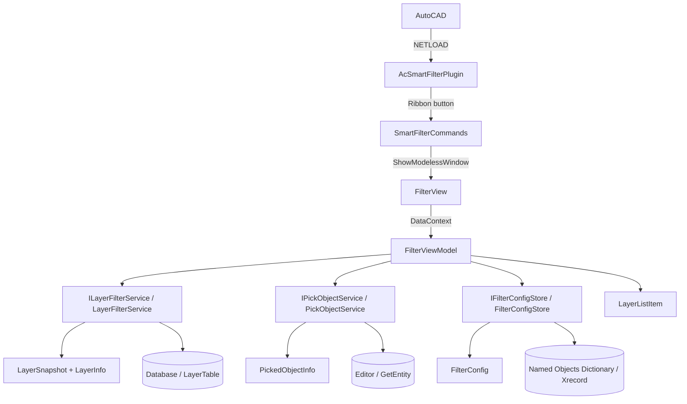

# Документация AcSmartFilterPlugin

Плагин для AutoCAD: фильтрация видимости слоёв активного чертежа через modeless-окно. Стек — C# / .NET Framework 4.8, AutoCAD .NET API, WPF + MVVM.

---

## 1. Структура проекта и точка входа

```
AcSmartFilterPlugin/
├── AcSmartFilterPlugin.sln
├── README.md
├── DOCUMENTATION.md
└── AcSmartFilterPlugin/
    ├── AcSmartFilterPlugin.cs          # Точка входа плагина (IExtensionApplication)
    ├── AcSmartFilterPlugin.csproj
    ├── Properties/
    │   └── AssemblyInfo.cs             # Метаданные сборки
    ├── Commands/
    │   └── SmartFilterCommands.cs      # Команды AutoCAD
    ├── Models/
    │   ├── FilterConfig.cs             # Сохраняемая конфигурация фильтра
    │   ├── LayerInfo.cs                # Снимок одного слоя
    │   ├── LayerSnapshot.cs            # Снимок всех слоёв + текущий слой
    │   └── PickedObjectInfo.cs         # Сведения об указанном объекте
    ├── Services/
    │   ├── ILayerFilterService.cs
    │   ├── LayerFilterService.cs       # Работа со слоями чертежа
    │   ├── IPickObjectService.cs
    │   ├── PickObjectService.cs        # Сведения об указанном объекте чертежа
    │   ├── IFilterConfigStore.cs
    │   └── FilterConfigStore.cs        # Persist конфигурации в DWG (Xrecord)
    ├── ViewModels/
    │   ├── FilterViewModel.cs          # Состояние и команды UI
    │   └── LayerListItem.cs            # Элемент списка слоёв
    ├── Views/
    │   ├── FilterView.xaml             # Окно фильтра
    │   └── FilterView.xaml.cs
    └── Mvvm/
        └── RelayCommand.cs             # ICommand для привязок
```

### Точка входа

Загрузка через атрибут сборки:

```csharp
[assembly: ExtensionApplication(typeof(AcSmartFilterPlugin.AcSmartFilterPlugin))]
```

После `NETLOAD` AutoCAD создаёт экземпляр `AcSmartFilterPlugin` и вызывает `IExtensionApplication.Initialize()`.

Цепочка запуска:

1. **`AcSmartFilterPlugin.Initialize()`** — создаёт вкладку Ribbon «Smart Filter» (сразу или после готовности Ribbon).
2. Кнопка Ribbon через **`SendCommandHandler`** отправляет в документ строку `SmartFilter `.
3. **`SmartFilterCommands.ShowSmartFilter()`** (`[CommandMethod("SmartFilter")]`) открывает `FilterView` как modeless-окно.
4. **`FilterView`** создаёт `FilterViewModel` + сервисы, на `Loaded` вызывает `Initialize()`, на `Closed` — `RestoreOriginalState()`.

Команды регистрируются атрибутом:

```csharp
[assembly: CommandClass(typeof(AcSmartFilterPlugin.Commands.SmartFilterCommands))]
```

---

## 2. Классы: роли и взаимодействие

### Диаграмма взаимодействия



---

### Точка входа и команды

#### `AcSmartFilterPlugin` (`AcSmartFilterPlugin.cs`)

Реализует `IExtensionApplication`. Живёт всю сессию AutoCAD.

| Метод / тип | Назначение |
|---|---|
| `Initialize()` | Создаёт Ribbon сразу или подписывается на `ComponentManager.ItemInitialized` |
| `Terminate()` | Отписывается от события Ribbon |
| `CreateRibbon()` | Вкладка `Smart Filter`, панель `Filters`, кнопка с командой `SmartFilter` |
| `OnRibbonItemInitialized` | Отложенное создание UI, когда Ribbon ещё не готов при старте |
| `SendCommandHandler` (вложенный) | `ICommand`: `SendStringToExecute("SmartFilter ")` в активный документ |

Не содержит бизнес-логики фильтрации — только bootstrap UI и проброс команды.

#### `SmartFilterCommands` (`Commands/SmartFilterCommands.cs`)

Класс команд AutoCAD.

| Метод | Команда | Назначение |
|---|---|---|
| `ShowSmartFilter()` | `SmartFilter` | Открывает/активирует единственное окно `FilterView` (статическая ссылка, чтобы не собрал GC) |
| `MyCommand()` | `MyCommand` | Шаблон: пишет сообщение в Editor |
| `MyPickFirst()` | `MyPickFirst` | Шаблон: работа с pickfirst-выбором |

Связь: единственная рабочая команда → `Views.FilterView`.

---

### View (UI)

#### `FilterView` (`Views/FilterView.xaml` + `.xaml.cs`)

WPF-окно «Выбор данных». Code-behind тонкий: composition root для VM и сервисов.

При создании:

```csharp
_viewModel = new FilterViewModel(
    new LayerFilterService(),
    new PickObjectService(),
    new FilterConfigStore());
```

| Событие | Действие |
|---|---|
| `Loaded` | `_viewModel.Initialize()` — загрузка слоёв и сохранённой конфигурации |
| `Closed` | `_viewModel.RestoreOriginalState()` — откат видимости слоёв к снимку |
| `FilterViewModel.CloseRequested` | `Close()` — закрытие окна по кнопке «Отмена» |
| `FilterViewModel.ActivationRequested` | `Activate()` — возврат фокуса окну после выбора в чертеже |

XAML привязки:

- `Layers` → ListBox (множественный выбор через `LayerListItem.IsSelected`)
- `UseCurrentLayer` → CheckBox
- `IsLayerListEnabled` → доступность списка
- `PickObjectCommand` → кнопка «Указать объект» под списком
- `PickedObjectDescription` → GroupBox «Указанный объект»
- `ResetCommand` → кнопка «Сбросить» (отдельная строка над кнопками диалога)
- `CancelCommand` / `ApplyCommand` → кнопки «Отмена» и «Применить»; `Escape` привязан к `CancelCommand` через `Window.InputBindings`

#### `RelayCommand` (`Mvvm/RelayCommand.cs`)

Простой `ICommand`: `Action` + опциональный `Func<bool> CanExecute`. `CanExecuteChanged` связан с `CommandManager.RequerySuggested`.

Используется только `FilterViewModel` для Apply/Reset.

---

### ViewModel

#### `FilterViewModel` (`ViewModels/FilterViewModel.cs`)

Центр UI-логики. Зависит от `ILayerFilterService` и `IFilterConfigStore`.

| Свойство / команда | Роль |
|---|---|
| `Layers` | `ObservableCollection<LayerListItem>` — список слоёв |
| `UseCurrentLayer` | Режим «только текущий слой»; при `true` сбрасывает ручной выбор |
| `IsLayerListEnabled` | `!UseCurrentLayer` |
| `ApplyCommand` | Применить фильтр + сохранить конфиг в DWG |
| `ResetCommand` | Сброс выбора и восстановление исходного состояния слоёв |
| `CancelCommand` | Запрос закрытия окна без применения фильтра (`CloseRequested`) |
| `PickObjectCommand` | Указать объект в чертеже → отметить его слой в списке |
| `PickedObject` | `PickedObjectInfo` последнего указанного объекта (или `null`) |
| `PickedObjectDescription` | Тип, слой и хэндл указанного объекта для вывода в окне |
| `IsPicking` | Идёт запрос выбора; блокирует повторный вызов |
| `CloseRequested` | Событие для представления: закрыть окно |
| `ActivationRequested` | Событие для представления: вернуть фокус окну |

| Метод | Поведение |
|---|---|
| `Initialize()` | `LoadLayers()` → заполнение списка → `RestoreSavedConfig()` |
| `RestoreSavedConfig()` | Читает `FilterConfig` из чертежа, восстанавливает checkbox/выбор |
| `ApplyFilter()` | Берёт `ObjectId` слоёв → `ApplyFilter` → `Save` конфигурации |
| `Reset()` | Выкл. «текущий слой», очистка выбора слоёв и указанного объекта, `RestoreState` |
| `Cancel()` | Поднимает `CloseRequested`; откат делает `Closed` окна |
| `PickObject()` | `async void`: `PickObjectAsync` → `PickedObject` + `SelectLayer`; исключения гасятся |
| `SelectLayer(id)` | Отмечает один слой, снимает остальные; неизвестный слой — выбор не меняет |
| `RestoreOriginalState()` | Восстановление по `_originalSnapshot` (при закрытии окна) |
| `GetSelectedLayerIds()` | Либо `Clayer`, либо выбранные в списке |

Хранит `_originalSnapshot` — состояние на момент открытия окна.

#### `LayerListItem` (`ViewModels/LayerListItem.cs`)

Элемент UI-списка: `ObjectId Id`, `string Name`, `bool IsSelected` (`INotifyPropertyChanged`).  
`FilterViewModel` слушает `PropertyChanged` по `IsSelected`, чтобы обновлять `CanExecute` у Apply.

---

### Models (DTO)

#### `LayerInfo`

Неизменяемый снимок слоя: `Id`, `Name`, `IsOff`, `IsFrozen`.  
Создаётся в `LayerFilterService.LoadLayers()`.

#### `LayerSnapshot`

Набор `LayerInfo` + `CurrentLayerId`.  
Нужен для отката после фильтрации / закрытия окна.

#### `FilterConfig`

То, что пишется в DWG: `LayerNames` (по имени, не по `ObjectId`) + `UseCurrentLayer`.  
Имена переживают перезагрузку чертежа; `ObjectId` — нет.

#### `PickedObjectInfo`

Неизменяемые сведения об указанном объекте: `Id`, `Handle`, `ObjectType`, `LayerId`, `LayerName`.  
Создаётся в `PickObjectService.PickObjectAsync()`; VM берёт из него `LayerId` для выбора слоя, остальное показывает в окне.

---

### Services

#### `ILayerFilterService` / `LayerFilterService`

Единственное место с транзакциями и `LockDocument` для слоёв.

| Метод | Что делает |
|---|---|
| `HasActiveDocument` | Есть ли `MdiActiveDocument` |
| `GetCurrentLayerId()` | `Database.Clayer` |
| `LoadLayers()` | Читает `LayerTable`, возвращает `LayerSnapshot` |
| `ApplyFilter(ids)` | Выбранные: On + разморозить; остальные: Off. При необходимости меняет текущий слой, чтобы AutoCAD не ругался. `Regen()` |
| `RestoreState(snapshot)` | Возвращает `Clayer`, `IsOff`, `IsFrozen` (с оговоркой: текущий слой нельзя заморозить) |

#### `IPickObjectService` / `PickObjectService`

Указание одного объекта в чертеже и чтение его характеристик.

| Метод | Что делает |
|---|---|
| `PickObjectAsync()` | `MainWindow.Focus()` → `ExecuteInCommandContextAsync` → `Editor.GetEntity` → `PickedObjectInfo` (или `null` при отмене) |

Два обязательных условия для modeless-окна:

- запросы редактора допустимы только в контексте команды, отсюда `DocumentCollection.ExecuteInCommandContextAsync`;
- фокус нужно передать окну AutoCAD, иначе указать объекты мышью не получится.

Сведения берутся у примитива верхнего уровня: объект внутри блока или xref даёт вставку (`INSERT`) и её слой, а не вложенный элемент. Тип — DXF-имя из `Entity.GetRXClass()`, при его отсутствии имя .NET-класса. Отмена запроса и ошибки AutoCAD дают `null`.

#### `IFilterConfigStore` / `FilterConfigStore`

Persist настроек внутри DWG:

```
Named Objects Dictionary
  └── "AcSmartFilterPlugin" (DBDictionary)
        └── "FilterConfig" (Xrecord)
              ResultBuffer: Int16 (UseCurrentLayer) + Text[] (имена слоёв)
```

| Метод | Назначение |
|---|---|
| `Save(FilterConfig)` | Создаёт/обновляет словарь и Xrecord |
| `Load()` | Читает Xrecord → `FilterConfig` или `null` |

Вызывается из VM: `Load` при открытии, `Save` при Apply.

---

### Вспомогательные

| Класс | Роль |
|---|---|
| `AssemblyInfo` | Версия, GUID, copyright сборки |

Команды объявлены формой `[CommandMethod(группа, имя, флаги)]`, без локализованного имени. Это принципиально: с четырёхаргументной формой в паре с `[assembly: CommandClass]` AutoCAD ищет ресурсы по полному имени класса команд (`AcSmartFilterPlugin.Commands.SmartFilterCommands.resources`), и при их отсутствии `ExtensionLoader` роняет загрузку всей сборки с `MissingManifestResourceException`.

---

## 3. Типичные сценарии

### Открытие фильтра

```
Ribbon / команда SmartFilter
  → SmartFilterCommands.ShowSmartFilter
  → new FilterView
  → FilterViewModel.Initialize
      → LayerFilterService.LoadLayers  → snapshot
      → заполнение Layers
      → FilterConfigStore.Load → восстановление выбора
```

### Выбор слоя по объекту чертежа

```
PickObjectCommand (кнопка «Указать объект»)
  → IsPicking = true (кнопка заблокирована)
  → PickObjectService.PickObjectAsync
      → MainWindow.Focus
      → ExecuteInCommandContextAsync → Editor.GetEntity → PickedObjectInfo
  → PickedObject → GroupBox «Указанный объект» (тип, слой, хэндл)
  → SelectLayer: отметить слой объекта, снять остальные
  → ActivationRequested → окно снова активно
```

Кнопка недоступна при включённом режиме «текущий слой» (список тоже заблокирован) и пока идёт запрос. Фильтр не применяется — только меняется выбор в списке.

### Применить

```
ApplyCommand
  → GetSelectedLayerIds
  → LayerFilterService.ApplyFilter  (видимость слоёв)
  → FilterConfigStore.Save          (конфиг в DWG)
```

Окно остаётся открытым; видимость уже изменена. При закрытии окна вызывается `RestoreOriginalState` — слои возвращаются к состоянию на момент открытия.

### Сбросить

```
ResetCommand
  → UseCurrentLayer = false, ClearSelection, PickedObject = null
  → RestoreOriginalState (без закрытия окна)
```

Кнопка доступна всегда: сбросить можно и уже применённый фильтр.

### Отмена

```
CancelCommand (кнопка «Отмена» или Escape)
  → CloseRequested
  → FilterView.Close
  → Closed → RestoreOriginalState
```

---

## 4. Архитектурные границы

| Слой | Ответственность | Не знает о |
|---|---|---|
| Commands / Extension | Загрузка, Ribbon, показ окна | Детали слоёв / Xrecord |
| View | Разметка, binding | AutoCAD Database |
| ViewModel | Состояние UI, оркестрация | Транзакции (через интерфейсы) |
| Services | AutoCAD API, DWG I/O | WPF / XAML |
| Models | Чистые данные | UI и AutoCAD UI |

Composition root сейчас — конструктор `FilterView` (ручное создание сервисов, без DI-контейнера).
